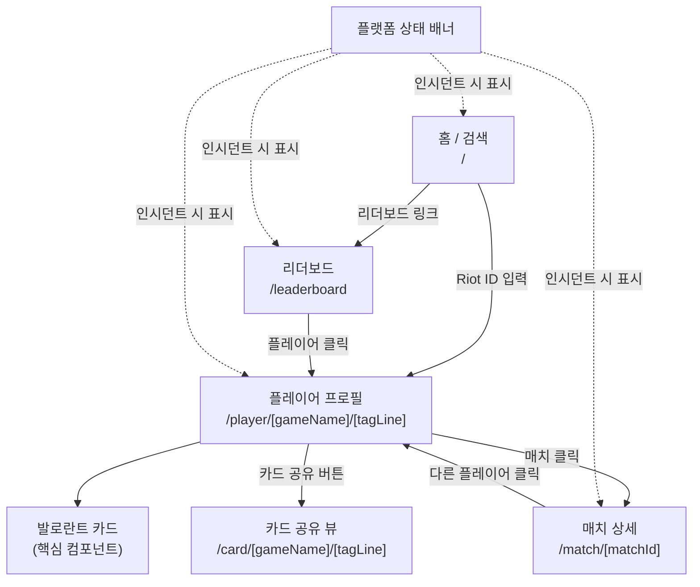

# VALORANT CARD — 화면 기획서

## 1. 개요

발로란트 플레이어의 전적을 시각적 **"카드"** 로 생성하고 공유하는 웹 애플리케이션.

- **핵심 기능**: Riot ID 검색 → 전적 집계 → 발로란트 카드 생성 → 공유
- **테마**: 다크 모드
- **언어**: 한국어
- **반응형**: 모바일 우선, Tailwind 브레이크포인트 (`sm` 640 / `md` 768 / `lg` 1024 / `xl` 1280)

---

## 2. 화면 목록

| #   | 화면            | 라우트                         | 주요 API                          |
| --- | --------------- | ------------------------------ | --------------------------------- |
| 1   | 홈 / 검색       | `/`                            | Status                            |
| 2   | 플레이어 프로필 | `/player/[gameName]/[tagLine]` | Account, Match List, Match Detail |
| 3   | 매치 상세       | `/match/[matchId]`             | Match Detail                      |
| 4   | 리더보드        | `/leaderboard`                 | Ranked, Content (act 목록)        |
| 5   | 카드 공유       | `/card/[gameName]/[tagLine]`   | Account, Match List, Match Detail |
| 6   | OG 이미지 (API) | `/api/og/[gameName]/[tagLine]` | 동일                              |

---

## 3. 화면 흐름도



---

## 4. 화면별 상세 기획

### 4.1 홈 / 검색 (`/`)

**목적**: 앱 진입점. Riot ID를 입력하여 플레이어를 검색한다.

#### 레이아웃

```
┌──────────────────────────────────────────┐
│  [플랫폼 상태 배너] (인시던트 시에만)       │
├──────────────────────────────────────────┤
│                                          │
│           VALORANT CARD                  │
│   나만의 발로란트 전적 카드를 만들어보세요    │
│                                          │
│   ┌────────────────────────┬──────┐      │
│   │ gameName#tagLine       │ 검색  │      │
│   └────────────────────────┴──────┘      │
│                                          │
│   최근 검색                               │
│   ┌──────────────────────────────┐       │
│   │ Player1#KR1            ✕     │       │
│   │ Player2#NA1            ✕     │       │
│   └──────────────────────────────┘       │
│                                          │
│                    [리더보드 보기 →]        │
│                                          │
└──────────────────────────────────────────┘
```

#### 구성 요소

| 요소             | 설명                                   | 데이터 소스                                 |
| ---------------- | -------------------------------------- | ------------------------------------------- |
| 앱 타이틀        | "VALORANT CARD" + 서브 텍스트          | 정적                                        |
| 검색 입력        | `gameName#tagLine` 형식, `#` 기준 파싱 | 사용자 입력                                 |
| 최근 검색 기록   | 최대 5개, 개별 삭제 가능               | `localStorage`                              |
| 플랫폼 상태 배너 | 점검/인시던트 정보                     | `PlatformStatus.maintenances` + `incidents` |
| 리더보드 링크    | `/leaderboard`로 이동                  | 정적                                        |

#### 인터랙션

- **검색 제출**: `gameName`과 `tagLine`을 파싱하여 `/player/[gameName]/[tagLine]`로 라우팅
- **유효성 검사**: `#` 구분자 필수, 양쪽 모두 비어있으면 안 됨 → 인라인 에러 표시
- **최근 검색 클릭**: 해당 프로필 페이지로 이동
- **최근 검색 삭제**: `✕` 버튼으로 개별 항목 제거

#### 반응형

- **모바일**: 검색 입력 전체 너비, 중앙 정렬 스택
- **데스크톱**: `max-w-2xl` 중앙 컨테이너

---

### 4.2 플레이어 프로필 (`/player/[gameName]/[tagLine]`)

**목적**: 핵심 화면. 발로란트 카드와 종합 전적, 매치 히스토리를 한 페이지에서 보여준다.

#### 데이터 페칭 흐름

```
gameName#tagLine
  → Account API → puuid
  → Match List API (puuid) → matchIds[] (최대 20개)
  → Match Detail API × N (배치) → MatchDetails[]
  → 클라이언트 집계 → KDA, 승률, ACS, HS%, 모스트 에이전트
```

#### 레이아웃

```
┌──────────────────────────────────────────────────────┐
│  [← 홈] ┌─────────────────────┬──────┐ [리더보드]    │
│          │ gameName#tagLine    │ 검색  │              │
│          └─────────────────────┴──────┘              │
├──────────────────────────────────────────────────────┤
│                                                      │
│  ┌─ 플레이어 헤더 ──────────────────────────────┐     │
│  │  [플레이어 카드 이미지]                       │     │
│  │  gameName#tagLine                           │     │
│  │  🏆 플래티넘 2  (현재 랭크)                   │     │
│  └──────────────────────────────────────────────┘     │
│                                                      │
│  ┌─ 발로란트 카드 (Hero) ───────────────────────┐     │
│  │                                              │     │
│  │  ┌────────────────────────────────────┐      │     │
│  │  │          VALORANT CARD             │      │     │
│  │  │                                    │      │     │
│  │  │  [모스트 에이전트           랭크    │      │     │
│  │  │   풀 초상화]              뱃지     │      │     │
│  │  │                                    │      │     │
│  │  │  gameName#tagLine                  │      │     │
│  │  │                                    │      │     │
│  │  │  KDA 4.2  |  승률 58%             │      │     │
│  │  │  ACS 245  |  HS% 28%             │      │     │
│  │  │                                    │      │     │
│  │  │  모스트: 제트 > 레이나 > 소바       │      │     │
│  │  └────────────────────────────────────┘      │     │
│  │                                              │     │
│  │  [카드 공유하기]                              │     │
│  └──────────────────────────────────────────────┘     │
│                                                      │
│  ┌─ 전적 요약 ──────────────────────────────────┐     │
│  │                                              │     │
│  │  승/패 바  ██████████░░░░░░  12승 8패         │     │
│  │                                              │     │
│  │  ┌──────────┐ ┌──────────┐ ┌──────────┐     │     │
│  │  │ K/D      │ │ 평균 데미지│ │ 평균 ACS  │     │     │
│  │  │ 1.35     │ │ 152.3    │ │ 245.1    │     │     │
│  │  └──────────┘ └──────────┘ └──────────┘     │     │
│  │                                              │     │
│  │  모스트 에이전트 Top 3                        │     │
│  │  ┌──────┐ ┌──────┐ ┌──────┐                 │     │
│  │  │ 제트  │ │레이나 │ │ 소바  │                 │     │
│  │  │ 8게임 │ │ 6게임 │ │ 4게임 │                 │     │
│  │  │ 75%W │ │ 50%W │ │ 50%W │                 │     │
│  │  └──────┘ └──────┘ └──────┘                 │     │
│  └──────────────────────────────────────────────┘     │
│                                                      │
│  ┌─ 매치 히스토리 ──────────────────────────────┐     │
│  │                                              │     │
│  │  [전체] [경쟁전] [일반전] [데스매치]  ← 필터 탭 │     │
│  │                                              │     │
│  │  ┌───────────────────────────────────────┐   │     │
│  │  │ 승리  | 제트  | 25/10/5 | 헤이븐       │   │     │
│  │  │ 13-7  | 경쟁전 | ACS 312 | 2시간 전     │   │     │
│  │  ├───────────────────────────────────────┤   │     │
│  │  │ 패배  | 레이나 | 15/18/3 | 바인드       │   │     │
│  │  │ 10-13 | 경쟁전 | ACS 198 | 3시간 전     │   │     │
│  │  ├───────────────────────────────────────┤   │     │
│  │  │ ...                                   │   │     │
│  │  └───────────────────────────────────────┘   │     │
│  └──────────────────────────────────────────────┘     │
│                                                      │
└──────────────────────────────────────────────────────┘
```

#### 섹션별 데이터 매핑

**플레이어 헤더**

| 항목                 | 타입 필드                                      | 비고                                                          |
| -------------------- | ---------------------------------------------- | ------------------------------------------------------------- |
| 플레이어 이름        | `RiotAccount.gameName` + `tagLine`             | Account API                                                   |
| 플레이어 카드 이미지 | `MatchPlayer.playerCard`                       | `https://media.valorant-api.com/playercards/{id}/wideart.png` |
| 현재 랭크            | `MatchPlayer.competitiveTier` (최신 랭크 매치) | 랭크 티어 매핑 필요                                           |

**발로란트 카드 (핵심 컴포넌트)**

| 항목                   | 산출 방식                                                  |
| ---------------------- | ---------------------------------------------------------- |
| 모스트 에이전트 풀 초상화 | `characterId` 빈도 → `CHARACTERS[].fullPortrait`           |
| KDA                    | `Σ(kills + assists) / Σ(deaths)` (전체 매치)               |
| 승률                   | 승리 매치 수 / 전체 매치 수 × 100                          |
| ACS (평균 전투 점수)   | `Σ(stats.score) / Σ(stats.roundsPlayed)`                   |
| HS% (헤드샷 비율)      | `Σ(headshots) / Σ(headshots + bodyshots + legshots)` × 100 |
| 모스트 에이전트 Top 3  | `characterId` 빈도 상위 3 → `CHARACTERS[].name`            |
| 랭크 뱃지              | 최신 `competitiveTier` → 랭크 아이콘                       |

> 승리 판정: 플레이어의 `teamId`와 일치하는 `MatchTeam`의 `won === true` 여부

**전적 요약 패널**

| 항목                  | 산출 방식                                    |
| --------------------- | -------------------------------------------- |
| 승/패 바              | 승리/패배 수를 비율 바로 시각화              |
| K/D 비율              | `Σ(kills) / Σ(deaths)`                       |
| 평균 데미지           | `RoundPlayerStats.damage` 합산 / 라운드 수   |
| 평균 ACS              | `stats.score / stats.roundsPlayed` 매치 평균 |
| 모스트 에이전트 Top 3 | 에이전트별 게임 수 + 승률                    |

**매치 히스토리**

| 항목      | 타입 필드                                            |
| --------- | ---------------------------------------------------- |
| 승/패     | `MatchTeam.won` (플레이어 teamId 기준)               |
| 에이전트  | `MatchPlayer.characterId` → `CHARACTERS` 매핑        |
| K / D / A | `PlayerStats.kills` / `deaths` / `assists`           |
| 스코어    | `MatchTeam.roundsWon` (양 팀)                        |
| 맵        | `MatchInfo.mapId` → 맵 이름 매핑                     |
| 큐 타입   | `MatchInfo.queueId` → 한글 라벨                      |
| ACS       | `stats.score / stats.roundsPlayed`                   |
| 시간      | `MatchInfo.gameStartMillis` → 상대 시간 ("2시간 전") |

#### 큐 필터 탭

| 탭       | `queueId` 값  |
| -------- | ------------- |
| 전체     | 모든 값       |
| 경쟁전   | `competitive` |
| 일반전   | `unrated`     |
| 데스매치 | `deathmatch`  |

> `MatchListEntry.queueId`로 클라이언트 사이드 필터링

#### 인터랙션

- **카드 공유 버튼**: `/card/[gameName]/[tagLine]`로 이동
- **매치 클릭**: `/match/[matchId]`로 이동
- **헤더 검색**: 새로운 플레이어 검색 → 프로필 페이지 갱신

#### 반응형

- **모바일**: 카드 전체 너비, 전적 요약과 매치 히스토리 세로 스택
- **데스크톱**: 카드 중앙 상단, 전적 요약 그리드 (3열), 매치 히스토리 넓은 테이블

#### 에러 상태

- **계정 미발견**: "플레이어를 찾을 수 없습니다" + 홈으로 돌아가기
- **매치 데이터 없음**: "최근 매치 기록이 없습니다" 안내 메시지
- **API 레이트 리밋**: "잠시 후 다시 시도해주세요" + 재시도 버튼

---

### 4.3 매치 상세 (`/match/[matchId]`)

**목적**: 단일 매치의 전체 정보를 라운드 단위로 분석한다.

#### 레이아웃

```
┌──────────────────────────────────────────────────────┐
│  [← 뒤로]                                            │
├──────────────────────────────────────────────────────┤
│                                                      │
│  ┌─ 매치 헤더 ──────────────────────────────────┐     │
│  │  헤이븐  |  경쟁전  |  35분 12초              │     │
│  │  2025.03.01 14:30                            │     │
│  │                                              │     │
│  │       BLUE  13 ━━━━━━━ 7  RED                │     │
│  └──────────────────────────────────────────────┘     │
│                                                      │
│  ┌─ 스코어보드 ─────────────────────────────────┐     │
│  │                                              │     │
│  │  BLUE (승리)                                  │     │
│  │  ┌──────┬────────────┬─────┬─────┬────┐      │     │
│  │  │에이전트│ 플레이어    │ KDA │ ACS │랭크 │      │     │
│  │  ├──────┼────────────┼─────┼─────┼────┤      │     │
│  │  │ 제트  │ Player1#KR │25/10│ 312 │ P2 │      │     │
│  │  │ 소바  │ Player2#KR │18/12│ 245 │ G3 │      │     │
│  │  │ ...  │ ...        │ ... │ ... │ .. │      │     │
│  │  └──────┴────────────┴─────┴─────┴────┘      │     │
│  │                                              │     │
│  │  RED (패배)                                   │     │
│  │  ┌──────┬────────────┬─────┬─────┬────┐      │     │
│  │  │ ...  │ ...        │ ... │ ... │ .. │      │     │
│  │  └──────┴────────────┴─────┴─────┴────┘      │     │
│  └──────────────────────────────────────────────┘     │
│                                                      │
│  ┌─ 라운드 타임라인 ────────────────────────────┐     │
│  │                                              │     │
│  │  R1  R2  R3  R4 ... R12 │ R13 R14 ... R20   │     │
│  │  🔵  🔵  🔴  🔵     🔵  │  🔴  🔵      🔵   │     │
│  │  ─── 공격 ──────────── │ ── 수비 ────────   │     │
│  │                                              │     │
│  │  ▼ 라운드 3 상세                              │     │
│  │  ┌──────────────────────────────────┐        │     │
│  │  │ 0:25  Player1 → Player6  (밴달)  │        │     │
│  │  │ 0:42  Player3 → Player8  (팬텀)  │        │     │
│  │  │ 1:10  💣 Player2 폭탄 설치        │        │     │
│  │  │ 1:35  Player7 → Player1  (오퍼)  │        │     │
│  │  └──────────────────────────────────┘        │     │
│  └──────────────────────────────────────────────┘     │
│                                                      │
│  ┌─ 퍼포먼스 ───────────────────────────────────┐     │
│  │  [데미지] [이코노미] [어빌리티]    ← 탭 전환   │     │
│  │                                              │     │
│  │  데미지 탭:                                   │     │
│  │  라운드별 데미지 → 가로 바 차트               │     │
│  │                                              │     │
│  │  이코노미 탭:                                 │     │
│  │  라운드별 장비 가치 (loadoutValue) 추이        │     │
│  │                                              │     │
│  │  어빌리티 탭:                                 │     │
│  │  ability1/2/grenade/ultimate 사용 횟수        │     │
│  └──────────────────────────────────────────────┘     │
│                                                      │
└──────────────────────────────────────────────────────┘
```

#### 섹션별 데이터 매핑

**매치 헤더**

| 항목        | 타입 필드                                            |
| ----------- | ---------------------------------------------------- |
| 맵          | `MatchInfo.mapId` → 맵 이름 매핑                     |
| 큐 타입     | `MatchInfo.queueId` → 한글 라벨                      |
| 경기 시간   | `MatchInfo.gameLengthMillis` → 분:초 변환            |
| 날짜        | `MatchInfo.gameStartMillis` → 날짜 포맷              |
| 최종 스코어 | `MatchTeam[0].roundsWon` vs `MatchTeam[1].roundsWon` |

**스코어보드**

| 항목       | 타입 필드                                            |
| ---------- | ---------------------------------------------------- |
| 팀 구분    | `MatchPlayer.teamId`                                 |
| 에이전트   | `MatchPlayer.characterId` → `CHARACTERS` 아이콘      |
| 플레이어명 | `MatchPlayer.gameName#tagLine` (클릭 시 프로필 이동) |
| K/D/A      | `PlayerStats.kills` / `deaths` / `assists`           |
| ACS        | `PlayerStats.score / PlayerStats.roundsPlayed`       |
| 랭크       | `MatchPlayer.competitiveTier` → 랭크 뱃지            |

**라운드 타임라인**

| 항목           | 타입 필드                                                                     |
| -------------- | ----------------------------------------------------------------------------- |
| 라운드 승리팀  | `RoundResult.winningTeam`                                                     |
| 킬 이벤트      | `RoundPlayerStats.kills[]` — `killer`, `victim`, `finishingDamage.damageItem` |
| 폭탄 설치/해제 | `RoundResult.bombPlanter`, `bombDefuser`                                      |

**퍼포먼스 탭**

| 탭       | 데이터                                                                                         |
| -------- | ---------------------------------------------------------------------------------------------- |
| 데미지   | `RoundPlayerStats.damage[]` — `damage`, `headshots`, `bodyshots`, `legshots`                   |
| 이코노미 | `RoundPlayerStats.economy` — `loadoutValue`, `spent`, `remaining`                              |
| 어빌리티 | `PlayerStats.abilityCasts` — `grenadeCasts`, `ability1Casts`, `ability2Casts`, `ultimateCasts` |

#### 인터랙션

- **플레이어명 클릭**: `/player/[gameName]/[tagLine]`로 이동
- **라운드 클릭**: 해당 라운드의 킬/이벤트 상세 펼침 (아코디언)
- **퍼포먼스 탭 전환**: 데미지/이코노미/어빌리티 간 전환
- **뒤로 버튼**: 이전 페이지로 복귀 (`router.back()`)

#### 반응형

- **모바일**: 스코어보드를 플레이어별 카드 형태로 스택, 라운드 타임라인 가로 스크롤
- **데스크톱**: 테이블 형태 스코어보드, 타임라인 전체 표시

---

### 4.4 리더보드 (`/leaderboard`)

**목적**: 선택한 Act의 랭크 리더보드를 조회한다.

#### 레이아웃

```
┌──────────────────────────────────────────────────────┐
│  [← 홈]                          [리더보드]           │
├──────────────────────────────────────────────────────┤
│                                                      │
│  ┌─ 리더보드 헤더 ──────────────────────────────┐     │
│  │                                              │     │
│  │  랭크 리더보드                                │     │
│  │  Act 선택: [Episode 8 Act 1  ▼]              │     │
│  │  총 플레이어: 12,345명                        │     │
│  └──────────────────────────────────────────────┘     │
│                                                      │
│  ┌─ 리더보드 테이블 ────────────────────────────┐     │
│  │  ┌────┬──────────────────┬──────┬──────┐     │     │
│  │  │ #  │ 플레이어          │  RR  │ 승수  │     │     │
│  │  ├────┼──────────────────┼──────┼──────┤     │     │
│  │  │ 1  │ TopPlayer#KR     │ 1,245│  320 │     │     │
│  │  │ 2  │ ProPlayer#KR     │ 1,198│  298 │     │     │
│  │  │ 3  │ GoodPlayer#KR    │ 1,150│  275 │     │     │
│  │  │ 4  │ Player4#KR       │ 1,102│  260 │     │     │
│  │  │ ...│ ...              │  ... │  ... │     │     │
│  │  └────┴──────────────────┴──────┴──────┘     │     │
│  │                                              │     │
│  │  [← 이전]  1 2 3 ... 10  [다음 →]            │     │
│  └──────────────────────────────────────────────┘     │
│                                                      │
└──────────────────────────────────────────────────────┘
```

#### 데이터 매핑

| 항목             | 타입 필드                                       |
| ---------------- | ----------------------------------------------- |
| Act 목록         | `GameContent.acts[]` — `name`, `id`, `isActive` |
| 순위             | `LeaderboardPlayer.leaderboardRank`             |
| 플레이어명       | `LeaderboardPlayer.gameName#tagLine`            |
| RR (랭크 레이팅) | `LeaderboardPlayer.rankedRating`                |
| 승수             | `LeaderboardPlayer.numberOfWins`                |
| 총 플레이어 수   | `Leaderboard.totalPlayers`                      |

#### 인터랙션

- **Act 드롭다운 변경**: 선택한 `actId`로 리더보드 API 재호출
- **플레이어명 클릭**: `/player/[gameName]/[tagLine]`로 이동
- **페이지네이션**: `size` (기본 20) + `startIndex`로 API 호출
- **Top 3 강조**: 1위(금), 2위(은), 3위(동) 시각적 구분

#### 반응형

- **모바일**: 테이블 간소화 (순위 + 이름 + RR만 표시)
- **데스크톱**: 전체 컬럼 + 넓은 테이블

---

### 4.5 카드 공유 (`/card/[gameName]/[tagLine]`)

**목적**: 발로란트 카드만 단독 렌더링하여 스크린샷/이미지 저장/링크 공유에 최적화한다.

#### 레이아웃

```
┌──────────────────────────────────────────┐
│                                          │
│  ┌────────────────────────────────────┐  │
│  │          VALORANT CARD             │  │
│  │                                    │  │
│  │  [모스트 에이전트           랭크    │  │
│  │   풀 초상화]              뱃지     │  │
│  │                                    │  │
│  │  gameName#tagLine                  │  │
│  │                                    │  │
│  │  KDA 4.2  |  승률 58%             │  │
│  │  ACS 245  |  HS% 28%             │  │
│  │                                    │  │
│  │  모스트: 제트 > 레이나 > 소바       │  │
│  └────────────────────────────────────┘  │
│                                          │
│  [이미지로 저장]  [링크 복사]  [닫기]      │
│                                          │
└──────────────────────────────────────────┘
```

#### 기능

| 기능        | 설명                                                 |
| ----------- | ---------------------------------------------------- |
| 이미지 저장 | `html2canvas` 등으로 카드 영역을 PNG 캡처 → 다운로드 |
| 링크 복사   | 현재 URL을 클립보드에 복사                           |
| 닫기        | 프로필 페이지로 복귀                                 |

#### OG 메타 태그

```html
<meta property="og:title" content="{gameName}#{tagLine}의 발로란트 카드" />
<meta property="og:image" content="/api/og/{gameName}/{tagLine}" />
<meta property="og:description" content="KDA: 4.2 | 승률: 58% | 모스트: 제트" />
```

#### OG 이미지 API (`/api/og/[gameName]/[tagLine]`)

- Next.js `ImageResponse` (`next/og`)로 서버사이드 이미지 생성
- 소셜 미디어 링크 프리뷰에 카드 이미지 자동 표시
- 해상도: 1200×630 (OG 이미지 권장 사이즈)

---

## 5. 공유 컴포넌트

| 컴포넌트             | 사용 화면                    | 설명                                              |
| -------------------- | ---------------------------- | ------------------------------------------------- |
| `SearchInput`        | 홈, 프로필 헤더              | Riot ID 입력 + `#` 파싱 + 유효성 검사             |
| `ValorantCard`       | 프로필, 카드 공유, OG 이미지 | 시그니처 전적 카드 컴포넌트                       |
| `MatchListItem`      | 프로필 (매치 히스토리 섹션)  | 단일 매치 요약 행                                 |
| `Scoreboard`         | 매치 상세                    | 10인 스코어보드 테이블                            |
| `AgentIcon`          | 프로필, 매치 상세            | `characterId` → `CHARACTERS` 상수의 아이콘 렌더링 |
| `RankBadge`          | 프로필, 매치 상세, 리더보드  | `competitiveTier` → 랭크 아이콘 + 이름            |
| `StatusBanner`       | 글로벌 레이아웃              | 플랫폼 인시던트/점검 배너                         |
| `RoundTimeline`      | 매치 상세                    | 라운드별 승패 시각화 타임라인                     |
| `PaginationControls` | 리더보드                     | 페이지 이동 컨트롤                                |

---

## 6. 라우트 구조

```
src/app/
├── page.tsx                              ← 홈 / 검색
├── layout.tsx                            ← 글로벌 레이아웃 + StatusBanner
├── player/
│   └── [gameName]/
│       └── [tagLine]/
│           └── page.tsx                  ← 플레이어 프로필
├── match/
│   └── [matchId]/
│       └── page.tsx                      ← 매치 상세
├── leaderboard/
│   └── page.tsx                          ← 리더보드
├── card/
│   └── [gameName]/
│       └── [tagLine]/
│           └── page.tsx                  ← 카드 공유 뷰
└── api/
    ├── og/
    │   └── [gameName]/
    │       └── [tagLine]/
    │           └── route.ts              ← OG 이미지 생성
    └── valorant/                         ← (기존 API 라우트, 변경 없음)
```

---

## 7. 데이터 흐름

```
┌─────────────┐     ┌──────────────┐     ┌───────────────┐
│ 사용자 입력   │     │ Next.js API  │     │ Riot Games    │
│ gameName#tag │────▶│ Routes       │────▶│ API           │
└─────────────┘     └──────┬───────┘     └───────────────┘
                           │
                    ┌──────▼───────┐
                    │ 데이터 집계    │
                    │ KDA, 승률,    │
                    │ ACS, HS%,    │
                    │ 모스트 에이전트 │
                    └──────┬───────┘
                           │
                    ┌──────▼───────┐
                    │ UI 렌더링     │
                    │ 발로란트 카드  │
                    └──────────────┘
```

### 집계 로직 상세

| 지표            | 수식                                                   | 소스 타입                                |
| --------------- | ------------------------------------------------------ | ---------------------------------------- |
| KDA             | `(kills + assists) / max(deaths, 1)`                   | `PlayerStats`                            |
| 승률            | `wins / totalGames × 100`                              | `MatchTeam.won` (플레이어 `teamId` 기준) |
| ACS             | `score / roundsPlayed`                                 | `PlayerStats`                            |
| HS%             | `headshots / (headshots + bodyshots + legshots) × 100` | `Damage` (라운드별 집계)                 |
| 평균 데미지     | `totalDamage / totalRounds`                            | `Damage.damage` 합산                     |
| 모스트 에이전트 | `characterId` 빈도 카운트 → `CHARACTERS` 매핑          | `MatchPlayer.characterId`                |

---

## 8. 구현 시 필요한 추가 상수

현재 코드베이스에 없어서 구현 시 추가해야 하는 데이터:

### 랭크 티어 매핑

`competitiveTier` (0~27) → 한글 랭크명 + 아이콘 URL

| 티어 범위 | 랭크           |
| --------- | -------------- |
| 0         | 언랭크         |
| 1~3       | 아이언 1~3     |
| 4~6       | 브론즈 1~3     |
| 7~9       | 실버 1~3       |
| 10~12     | 골드 1~3       |
| 13~15     | 플래티넘 1~3   |
| 16~18     | 다이아몬드 1~3 |
| 19~21     | 초월자 1~3   |
| 22~24     | 불멸 1~3     |
| 25~26     | (사용 안 함)   |
| 27        | 레디언트       |

> 아이콘: `https://media.valorant-api.com/competitivetiers/latest/{tier}/largeicon.png`

### 맵 이름 매핑

`mapId` (UUID) → 한글 맵명. Content API (`/api/valorant/content?locale=ko-KR`)의 `maps[]` 활용 가능.

### 큐 타입 라벨

| `queueId`        | 한글 라벨       |
| ---------------- | --------------- |
| `competitive`    | 경쟁전          |
| `unrated`        | 일반전          |
| `spikerush`      | 스파이크 러시   |
| `deathmatch`     | 데스매치        |
| `tournamentmode` | 토너먼트        |
| `onefa`          | 레플리케이션    |
| `ggteam`         | 에스컬레이션    |
| `newmap`         | 뉴맵            |
| `snowball`       | 스노우볼 파이트 |

---

## 9. 글로벌 네비게이션

```
┌──────────────────────────────────────────────────────┐
│  VALORANT CARD (로고)    [검색 입력 (compact)]  [리더보드] │
└──────────────────────────────────────────────────────┘
```

- **로고**: `/`로 이동
- **검색 입력**: 홈 이외의 페이지에서 컴팩트 형태로 표시
- **리더보드**: `/leaderboard`로 이동
- 모바일에서는 햄버거 메뉴 또는 하단 네비게이션 고려
