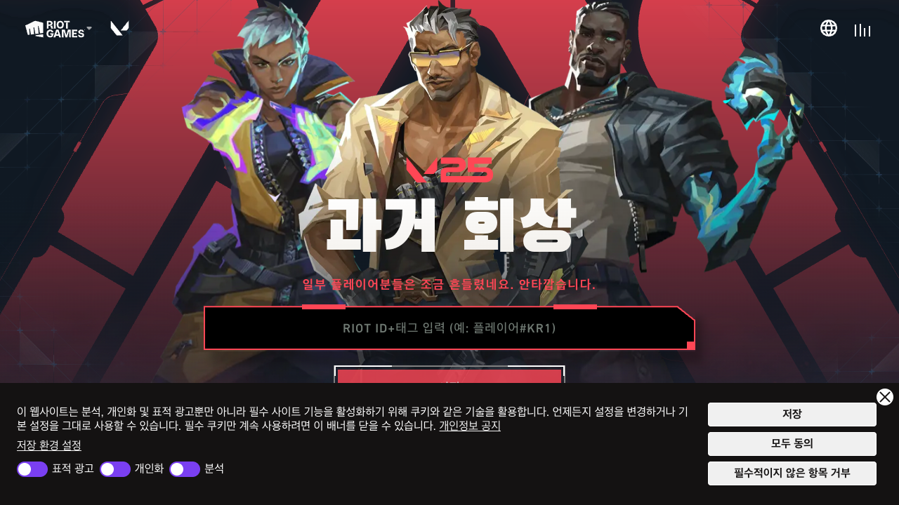
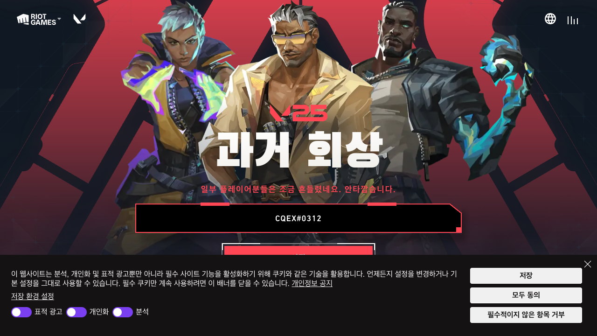
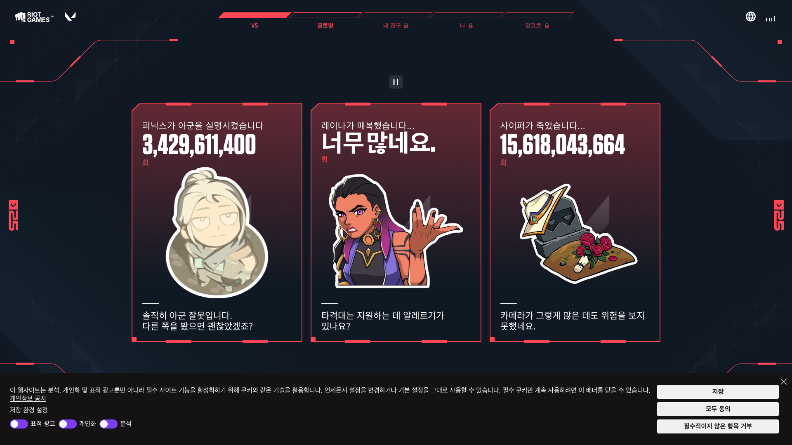
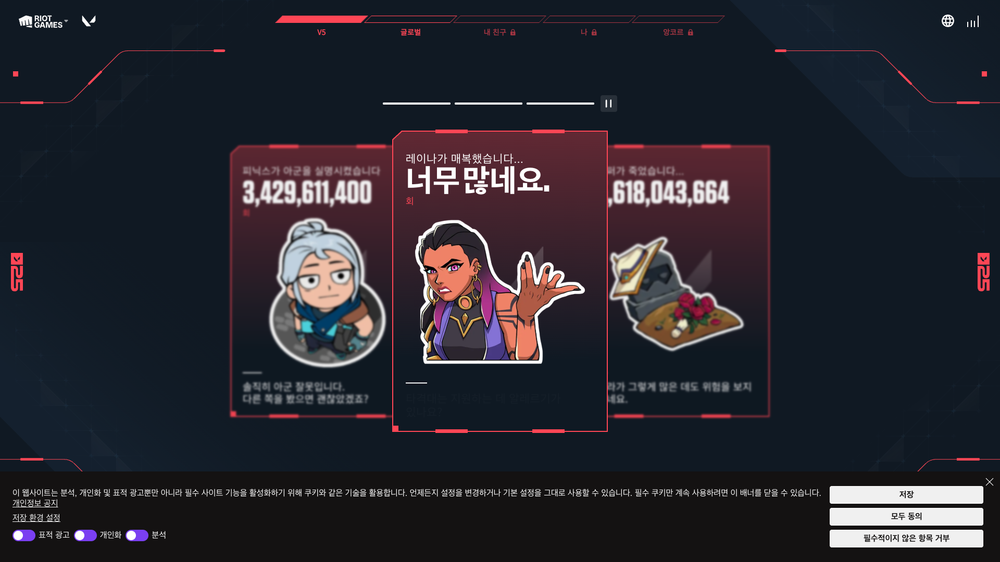
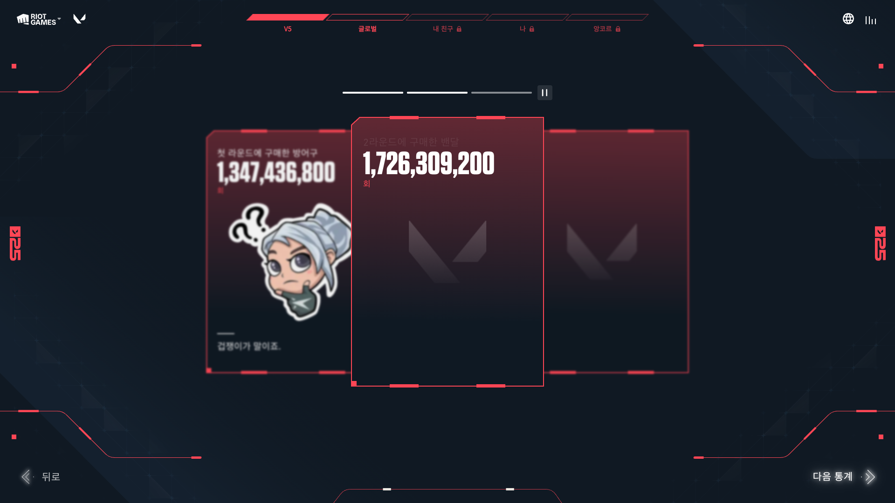
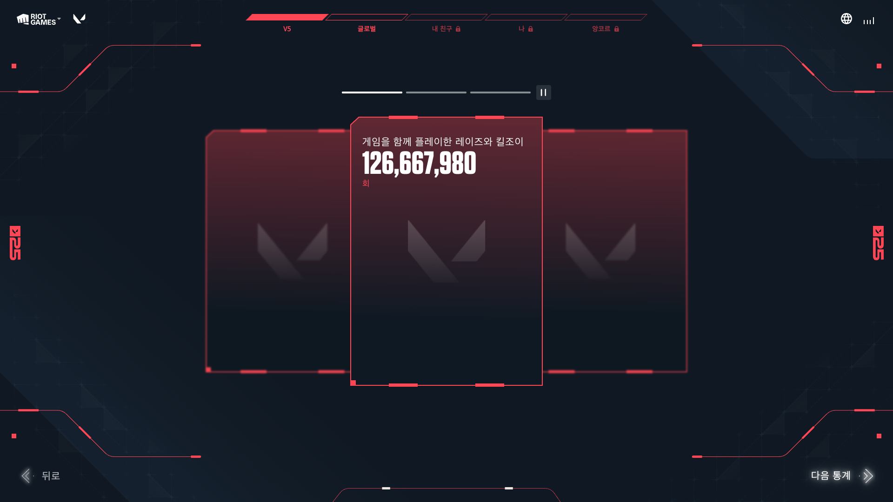
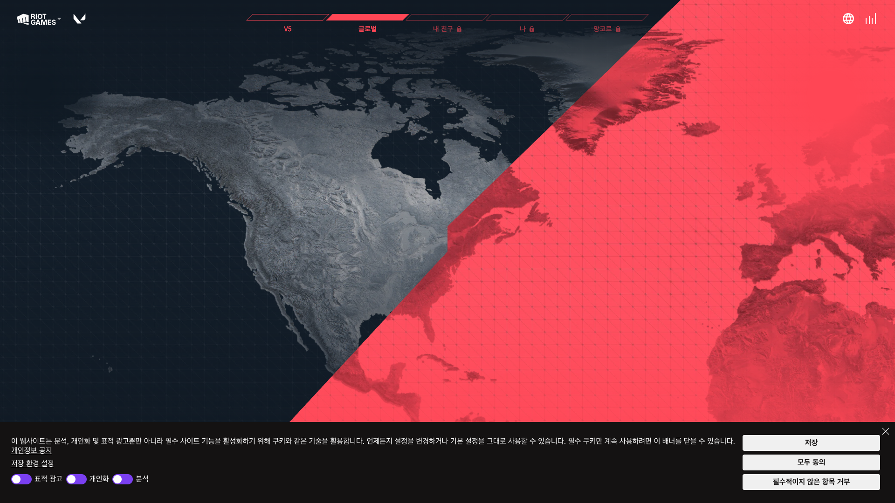
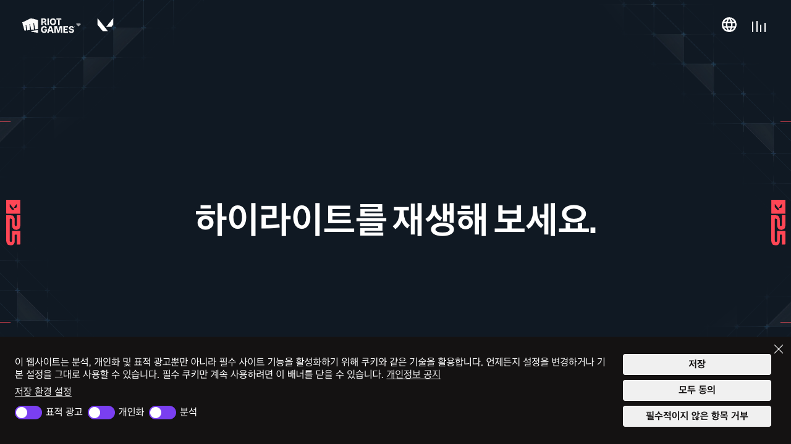

---
tags:
  - ui-ux
  - card-design
  - design-reference
status: published
category: ui-ux
date: 2025-04-05
related:
  - "[[card-view-system]]"
---

# 디자인 레퍼런스: FIFA Card × Valorant Flashback

## 개요

카드 상세 페이지(스탯, 퍼포먼스 뱃지, AI 피드백)의 디자인 방향성을 잡기 위해
**FIFA Ultimate Team 카드**와 **Valorant Flashback V5** 사이트를 레퍼런스로 분석.
두 디자인 언어를 융합하여 "발로란트 플레이어 카드"만의 아이덴티티를 만드는 것이 목표.

## 레퍼런스 소스

| 소스 | URL | 비고 |
|------|-----|------|
| Valorant Flashback V5 | `flashback.playvalorant.com/ko-KR` | Riot 공식, 2024 연말 회고 |
| FIFA Ultimate Team | - | EA Sports FUT 카드 시스템 전반 |

---

## Flashback V5 스크린샷

### 메인 (로그인 전)



- 배경: 발로란트 레드 → 다크 네이비 그라디언트 (대각선 분할)
- 에이전트 3명 일러스트 (카툰 스타일) 중앙 배치
- "과거 회상" 타이틀: 초대형 볼드, 화이트
- Riot ID 입력 필드: 하단 중앙, 그린 프로그레스 바

### Riot ID 입력



- 입력 완료 상태: `CQEX#0312`
- 프로그레스 바가 로딩 인디케이터로 전환

### V5 카드 캐러셀 (3장)



- **3장 카드 캐러셀**: 중앙 포커스 + 좌우 dim
- 각 카드 구조:
  - 상단: 한 줄 설명 텍스트 (캐주얼한 어투)
  - 중앙: **초대형 숫자** (콤마 포함, 카운터/타이머 느낌)
  - 하단: 에이전트 카툰 일러스트 + 코멘터리 텍스트
- 카드 프레임: 다크→레드 그라디언트 배경, 레드 보더
- 코너 장식: `S2E` 빨간 HUD 라인 (좌하단, 우하단)
- 하단 네비게이션: "뒤로" / "다음 통계" 버튼

### V5 캐러셀 스크롤



- 캐러셀 슬라이드 전환 중간 상태
- 중앙 카드에 포커스 (확대 + 밝기)
- 좌우 카드는 축소 + 어둡게 처리

### V5 스탯 카드 + V 로고



- 단일/2장 카드 레이아웃
- **발로란트 V 로고 워터마크**: 카드 배경에 반투명 배치
- HUD 보더: 코너에 빨간 L자 라인 장식
- 배경: 순수 다크 (#0A1929 계열) + 시안/틸 HUD 그리드 라인

### V5 단일 스탯 포커스



- 단일 카드 중앙 포커스
- 좌우에 빈 카드 프레임 (그림자/실루엣)
- V 로고 워터마크 더 크게
- "게임을 함께 플레이한 레이즈와 킬조이" + 대형 숫자

### 글로벌 탭



- 글로벌 통계 페이지: 세계 지도 시각화
- 레드 ↔ 그레이 대각선 분할 배경
- 상단 네비게이션: V5 / 글로벌 / 내 친구 / 나 / 앙코르

### 프리뷰 (로딩)



- 로딩 상태: "하이라이트를 재생해 보세요."
- 미니멀 다크 배경, HUD 코너 장식만 표시

---

## 디자인 요소 분석

### Color

| 요소 | 컬러 | 용도 |
|------|-------|------|
| 배경 | `#0A1929` ~ `#101923` | 어두운 네이비, 메인 배경 |
| 주요 악센트 | `#FF4655` (발로란트 레드) | 카드 보더, HUD 라인, 강조 텍스트 |
| 보조 악센트 | `#00C8FF` (시안/틸) | HUD 그리드 라인, 장식 요소 |
| 텍스트 | `#FFFFFF` | 메인 텍스트 |
| 텍스트 강조 | `#FF4655` | 숫자, 라벨 하이라이트 |
| 카드 배경 | 다크 → 레드 그라디언트 | 카드 내부 |
| 카드 보더 | `#FF4655` 1~2px | 카드 외곽선 |

### Typography

| 요소 | 스타일 | 비고 |
|------|--------|------|
| 대형 숫자 | 초대형 볼드, 콤마 포함 | 카운터/타이머 느낌, 카드 핵심 |
| 설명 텍스트 | 중간 사이즈, 캐주얼 어투 | "솔직히 아군 잘못입니다" |
| 라벨 | 소형 uppercase, tracking-widest | 카테고리/섹션 구분 |
| 코멘터리 | 중간 사이즈, 라이트 웨이트 | 하단 부연 설명 |

### Layout

| 패턴 | 설명 |
|------|------|
| 캐러셀 | 3장 카드, 중앙 포커스 (좌우 dim + 축소) |
| 풀스크린 | 전체화면 사용, 스크롤 최소화 |
| 네비게이션 | 상단 탭 바 + 하단 "뒤로/다음" 버튼 |
| 카드 비율 | 세로형 (약 3:4), 라운드 코너 |

### Decoration

| 요소 | 구현 방식 |
|------|-----------|
| HUD 코너 라인 | `border-t` + `border-r` 조합으로 L자 빨간 라인 |
| V 로고 워터마크 | 카드 배경에 반투명 발로란트 로고 |
| 네온 글로우 | `box-shadow` 레드 글로우 또는 border-gradient |
| 택티컬 그리드 | 배경에 미세한 시안 그리드 패턴 |
| 에이전트 일러스트 | 카툰/치비 스타일, 카드 하단 배치 |
| S2E 마커 | 좌하단/우하단 시즌 표시 텍스트 |

---

## FIFA Card 요소 (참고)

FIFA Ultimate Team 카드에서 차용할 수 있는 요소:

| 요소 | 설명 | 적용 가능성 |
|------|------|-------------|
| OVR 대형 숫자 | 종합 점수, 카드 좌상단 대형 표시 | ✅ CardScore OVR로 직접 대응 |
| 포지션 라벨 | OVR 하단에 포지션 약어 | ✅ 에이전트 역할(듀얼리스트 등)로 대응 |
| 6각형 스탯 | 6개 스탯 레이더/그리드 시각화 | ✅ 6개 CardStat과 1:1 대응 |
| 등급별 메탈릭 색감 | 골드, TOTY 블루, 아이콘 등 | ✅ 티어별 카드 배경으로 이미 구현 |
| 선수 사진 | 카드 중앙 인물 사진 | ✅ 에이전트 포즈 이미지로 대응 |
| 국기 + 팀 엠블럼 | 소속 표시 아이콘 | ⚠️ 서버 리전 + 에이전트 아이콘으로 변환 가능 |
| 수집형 프레임 | 등급별 고유 카드 프레임 디자인 | ✅ 티어별 카드 프레임으로 이미 구현 |

---

## Flashback V5 접근성 트리 주요 구조

Playwright로 추출한 접근성 트리 기반 구조 분석:

```
root
├── dialog "쿠키 동의 배너"
├── banner
│   ├── Riot Games 로고
│   ├── "발로란트 2024년 과거 회상" 로고
│   └── 소리 비활성화 버튼
├── main
│   ├── navigation "글로벌 탐색"
│   │   └── [V5] [글로벌] [내 친구] [나] [앙코르]
│   ├── 카드 캐러셀 영역
│   │   ├── 배경 이미지 레이어 (7+ img 요소)
│   │   ├── 일시정지 버튼
│   │   └── 카드 3장
│   │       ├── heading (설명 텍스트 — 이중 렌더링)
│   │       ├── paragraph (대형 숫자 — 자릿수별 span)
│   │       ├── img (에이전트 카툰 일러스트)
│   │       └── paragraph (코멘터리 — 이중 렌더링)
│   └── 네비게이션 버튼
│       ├── "뒤로" 버튼
│       └── "다음 통계" 버튼
└── footer
    ├── 다운로드 링크
    ├── 소셜 미디어 (유튜브, 인스타, 페이스북, 디스코드, X)
    └── 법적 고지
```

### 주목할 구현 패턴

- **숫자 이중 렌더링**: 대형 숫자를 자릿수별 `<span>`으로 분리 (애니메이션용) + 접근성용 숨김 텍스트
- **텍스트 이중 렌더링**: heading/commentary 텍스트를 두 번 렌더링 (시각 효과용 + 접근성용)
- **다층 배경**: 7개 이상의 이미지 레이어로 패럴랙스/깊이감 구현
- **탭 비활성화**: "내 친구", "나", "앙코르" 탭은 로그인 전 `disabled` 상태

---

## 현재 프로젝트 적용 상태

### 이미 구현된 것

- `CombatStats`: 6개 스탯 3×2 그리드, 택티컬 스타일 (빨간 수직바, 대형 숫자)
- `PerformanceBadges`: 6개 뱃지, 획득=하이라이트 / 미획득=dim
- `AIFeedback`: 터미널 스타일 AI 분석 리포트

### 디자인 융합 방향 (미확정)

> Deep Interview Round 2에서 중단. 아래는 초기 분석 기반 방향성.

1. **FIFA 구조 + Valorant 비주얼**: 카드 레이아웃/스탯 구조는 FIFA를 따르되, 색상/장식/질감은 Valorant 스타일
2. **HUD 장식 요소**: Flashback의 코너 HUD 라인, 택티컬 그리드를 카드 디테일에 적용
3. **대형 숫자 강조**: Flashback처럼 핵심 수치를 초대형으로 표시
4. **V 로고 워터마크**: 카드 배경에 반투명 발로란트 심볼
5. **티어별 차별화**: FIFA의 등급별 메탈릭 색감처럼 티어별 고유 카드 스타일 유지
