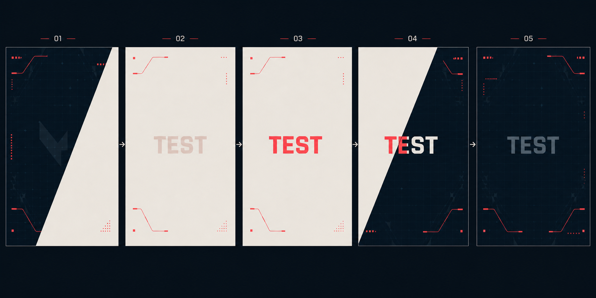

---
tags:
  - ui-ux
  - card-design
  - asset
  - image-generation
status: draft
category: card-design
date: 2026-05-04
related:
  - "docs/0405/card-view-system.md"
---

# 카드 등장 애니메이션 스토리보드

## 개요

카드 결과 화면 진입 전에 사용할 풀스크린 리빌 애니메이션 스토리보드.

VALORANT 클라이언트풍 HUD 전환을 참고하되, 실제 구현에서는 공식 로고와 브랜드 마크를 사용하지 않음.

## 스토리보드

## 전환 흐름

### 1. 어두운 HUD 시작

- 어두운 네이비 배경에서 시작함.
- 얇은 코랄 레드 HUD 라인과 희미한 기하학 그리드 노출.
- 밝은 대각 패널은 화면 오른쪽 바깥 또는 가장자리에서 대기함.
- 중앙 텍스트는 없거나 매우 약하게 유지함.

### 2. 밝은 대각 와이프

- 웜 오프화이트 대각 패널이 오른쪽에서 왼쪽으로 화면을 덮음.
- 화면 대부분이 밝은 패널로 전환됨.
- 중앙 `TEST` 텍스트는 낮은 opacity로 먼저 드러남.

### 3. 밝은 화면 고정

- 밝은 패널이 화면 전체를 점유함.
- 코랄 레드 HUD 라인이 화면 가장자리에 정렬됨.
- 중앙 `TEST` 텍스트가 코랄 레드로 명확하게 표시됨.

### 4. 원래 배경으로 복귀

- 밝은 대각 패널이 다시 빠지며 1번의 어두운 HUD 배경을 드러냄.
- 새 이미지 배경, 캐릭터 아트, 전장 이미지 사용하지 않음.
- 대각 경계선을 기준으로 `TEST` 색상이 밝은 영역에서는 코랄, 어두운 영역에서는 흰색 또는 회색으로 전환됨.
- 이 컷은 새로운 장면 등장 컷이 아니라 원래 배경 복귀 컷임.

### 5. 최종 환영 화면

- 어두운 네이비 HUD 배경으로 완전히 복귀함.
- 중앙 `TEST` 텍스트는 딤 그레이 톤으로 유지함.
- 하단 또는 중앙 하단 영역은 이후 플레이어 카드 등장에 사용할 수 있도록 비워둠.

## 구현 기준

- `/card/test`에서 먼저 검증함.
- 카드 DOM 저장 기능 때문에 `cardRef`는 실제 `TierCard` 루트에 유지함.
- 애니메이션 wrapper의 transform이 PNG 저장 결과에 남지 않도록 주의 필요.
- `prefers-reduced-motion` 환경에서는 와이프와 이동량을 줄이고 opacity 중심으로 처리함.
- 실제 `/card/[id]` 적용 전 테스트 페이지에서 타이밍과 레이어 순서를 확정함.

## 레이어 구조

- `intro-root`: 화면 전체를 덮는 fixed overlay.
- `hud-background`: 어두운 네이비 배경, 그리드, 코너 라인.
- `wipe-panel`: 웜 오프화이트 대각 패널.
- `intro-text`: 중앙 TEST 또는 실제 카피 텍스트.
- `card-stage`: 최종 카드 등장 영역.

## 타이밍 초안

- `0ms ~ 250ms`: HUD 배경 노출.
- `250ms ~ 800ms`: 밝은 대각 패널 진입.
- `800ms ~ 1300ms`: 밝은 화면과 중앙 텍스트 유지.
- `1300ms ~ 1900ms`: 대각 패널 퇴장, 어두운 HUD 배경 복귀.
- `1900ms ~ 2300ms`: 최종 텍스트 딤 처리.
- `2300ms 이후`: 카드 등장 애니메이션 시작.

## 미결정

- 실제 카피 문구 적용 여부 미정.
- 최종 카드 등장 방식 미정.
- 모바일에서 전체 intro를 유지할지 단축 버전으로 처리할지 미정.
