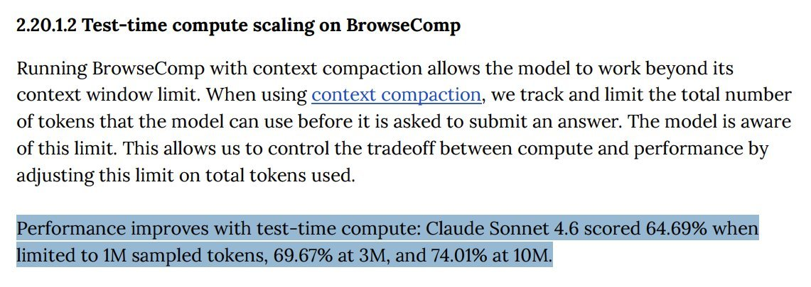
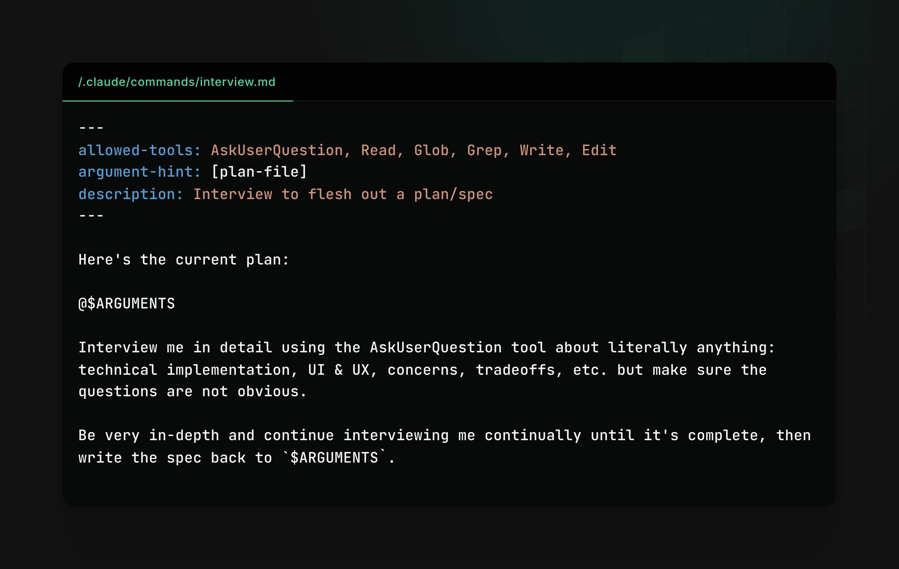
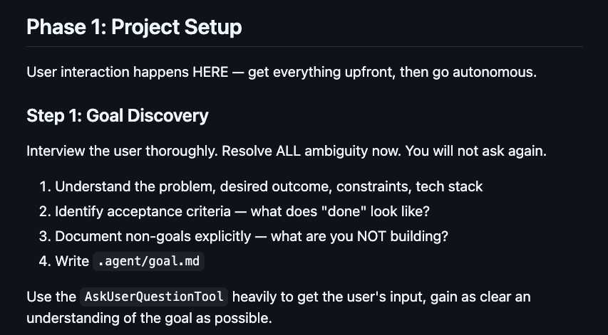
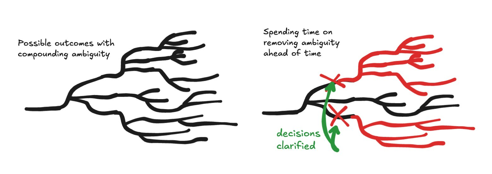
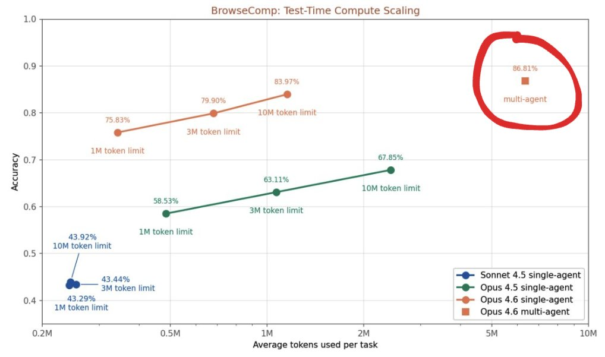
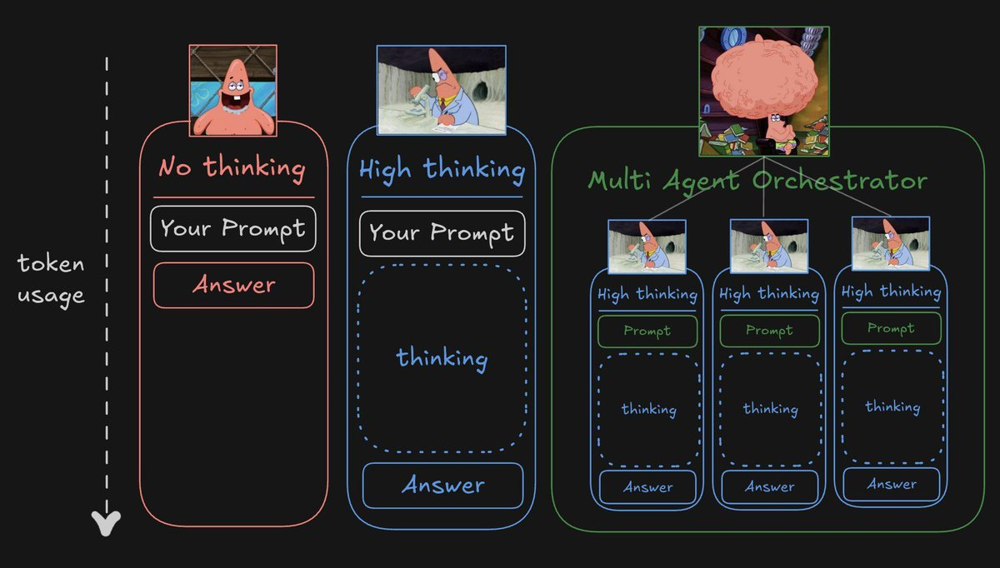

---
tags:
  - meta
  - specification
status: draft
category: meta
date: 2026-05-16
related: []
---

# 장기 실행 에이전트 워크플로우 번역 정리

## 출처

- 원문: https://x.com/jarrodwatts/status/2052372045829382430?s=20
- 작성자: Jarrod Watts
- 원문 게시 시각: 2026-05-07 21:56, X 표시 기준
- 수집일: 2026-05-16
- 원문 제목: You Need More Than a Ralph Loop

## 핵심 요지

- 장기 실행 에이전트는 더 많은 토큰을 사용하므로 성능이 좋아지는 경향이 있음.
- 단순 반복 루프만으로는 긴 작업의 모호성, 컨텍스트 한계, 품질 검증 문제를 해결하기 어려움.
- 작성자는 사전 인터뷰, 마일스톤 분해, 멀티 에이전트 리뷰, 파일 기반 크로스 컨텍스트 메모리를 조합한 워크플로우를 선호함.

## 번역

### Ralph Loop만으로는 부족함

지난 몇 달 동안 작성자는 Anthropic 채용 과제 해결을 포함해 여러 장기 실행 에이전트 실험을 진행함.
작성자가 배운 점은 장기 실행 에이전트가 작동하는 이유가 더 많은 토큰을 사용하기 때문이라는 점임.
연구자 관점에서는 이를 test-time compute 확장이라고 표현 가능함.

BrowseComp 벤치마크에서는 Sonnet 4.6이 토큰을 10배 더 사용했을 때 점수가 약 10%p 상승한 사례가 있음.
다만 작업에 필요한 컨텍스트가 에이전트의 컨텍스트 윈도우를 크게 넘어서면 이 접근이 무너지기 시작함.

이 문제를 풀기 위해 Ralph Wiggum loop 같은 접근이 등장함.
원래 형태의 Ralph loop는 같은 프롬프트를 반복 실행하는 방식임.

Codex 팀은 최근 원하는 목표를 달성할 때까지 며칠 동안 실행 가능한 내장 시스템인 goals를 출시함.
작성자는 이 기능에 기대했지만, GPT 5.5를 좋아함에도 실제 결과에는 실망했다고 설명함.
Codex가 오픈소스이기 때문에 내부 구현을 직접 확인했고, 그 결과 자신의 장기 실행 에이전트 워크플로우가 더 낫다고 판단함.

### Codex Goals 작동 방식

Codex의 goal 기능은 Codex CLI에서 `/goal <your goal>`을 실행해 더 야심 찬 작업을 한 번에 처리하려는 기능임.
내부적으로는 SQLite 기반의 단순한 구조를 사용함.
Codex는 `thread_goals` 테이블을 만들고, 사용자가 생성한 목표를 행으로 저장함.
각 행에는 목표 내용, ID, 상태, 선택적 토큰 예산이 포함됨.

Codex가 목표 달성을 시작하면 `get_goal`, `update_goal` 같은 도구를 사용해 진행 상황을 확인하고 데이터베이스의 목표 상태를 갱신함.
그 뒤에는 사실상 같은 프롬프트를 반복하는 표준 Ralph loop에 가까운 흐름을 사용함.
이 방식은 Codex가 15분마다 계속 진행해도 되는지 묻는 문제를 줄임.
하지만 작성자는 이 방식만으로 에이전트를 오랜 기간 효과적으로 실행하기 어렵다고 판단함.

### 작성자가 `/goal`에서 부족하다고 보는 점

작성자는 장기 실행 에이전트라는 아이디어 자체는 좋아함.
모델이 발전하면 한 번의 요청으로 복잡한 결과물을 만들 수 있다는 가능성에 가까운 개념이기 때문임.

다만 Codex의 `/goal` 기능은 지금까지의 사용 경험상 실망스러웠다고 설명함.
작성자가 과거에 직접 만든 실패한 장기 실행 에이전트 워크플로우와 같은 문제가 있었다고 봄.

작성자가 지적한 핵심 이유는 세 가지임.

- 모호성은 누적됨.
- 멀티 에이전트 구성이 단일 에이전트보다 유리함.
- 컨텍스트를 넘나드는 메모리가 효과적임.

### 모호성은 누적됨

LLM을 루프에 넣으면 각 반복의 출력이 다음 반복의 입력이 됨.
이 구조는 이후 반복마다 누적 효과를 만듦.

모델은 처음부터 끝까지 무언가를 만들라는 요청을 받으면 수많은 결정을 내림.
어느 시점에는 사용자가 내리지 않았을 결정을 내릴 수 있음.
그 뒤의 작업은 방향이 조금씩 어긋날 수 있음.

현실의 협업에서도 요구사항이 모호하면 기대했던 결과를 얻기 어려움.
대화와 조정 기회가 없으면 결과가 사용자의 의도와 달라질 가능성이 높음.

작성자는 에이전트 루프가 시작되기 전 setup phase에서 모호성을 최대한 낮추는 방식을 사용함.
이 방식은 Matt Pocock의 grill-me skill과 유사한 `/interview` 변형임.

코드를 실행하기 전에 사용자 상호작용이 발생하는 사전 단계에 많은 시간을 투자함.
이 과정을 거친 뒤 구체적이고 상세해진 목표를 마일스톤과 개별 작업으로 분해함.

작성자는 이 단계가 사용자 본인에게도 중요하다고 설명함.
에이전트만이 아니라 사용자도 실제로 무엇을 원하는지 명확히 생각하게 만들기 때문임.
Codex가 사용자가 생각하지 못한 질문과 가정을 제기하는 경우가 자주 있으며, 이런 세부 결정은 사전에 정리할 가치가 있음.

작성자는 이를 가능한 결과의 트리로 설명함.
각 분기는 최종 결과로 가기 위해 내려야 하는 결정임.
사전 명확화가 없으면 에이전트가 이 결정을 대신 내림.
그 결과 사용자가 원한 것과 약간 비슷할 뿐인 결과가 나올 수 있음.

반대로 초기에 더 많은 시간을 쓰면 장기 실행 에이전트가 시작되기 전에 방향을 교정 가능함.
사용자가 상상한 결과에서 멀리 떨어진 분기를 미리 제거할 수 있음.

### 멀티 에이전트 우위

연구와 작성자의 경험 모두에서 orchestrator와 subagent 관계를 사용하는 멀티 에이전트 구성이 단일 에이전트보다 나은 결과를 낸다고 봄.
토큰 사용량은 더 커지지만, 토큰 비용이 문제가 아니라면 결과 품질은 개선됨.

이는 토큰 사용을 수평으로 확장하는 방식임.
한 에이전트가 더 오래 생각하게 하는 대신 여러 에이전트가 함께 더 많이 생각하게 하는 구조임.

작성자의 워크플로우에서는 메인 장기 실행 에이전트가 orchestrator 역할을 함.
이 orchestrator는 개별 작업마다 subagent 팀을 자유롭게 만들 수 있음.

작은 팀은 개별 에이전트보다 높은 품질의 결과를 내기 위해 협업함.
보통 한 에이전트는 구현자 역할을 맡고, 다른 에이전트는 리뷰어 역할을 맡음.

구현 에이전트는 계획 단계에서 작은 작업으로 분해된 과제를 구현함.
그 뒤 리뷰어 에이전트에게 전달함.
리뷰어는 코드를 검토하고, 두 에이전트는 품질에 동의할 때까지 수정과 개선을 반복함.
이후 메인 orchestrator에게 작업 완료를 보고함.

작성자는 별도 컨텍스트 윈도우가 유용하다고 봄.
리뷰 에이전트는 코드를 처음 보는 상태에서 더 객관적으로 검토 가능함.
컨텍스트가 어수선해지면 에이전트가 잘못된 판단을 사실처럼 믿을 수 있기 때문에 새 관점이 필요함.

작성자는 원래 Claude Delegator를 만들어 Claude의 작업을 Codex가 리뷰하게 했음.
하지만 GPT 5.5 이후에는 프론트엔드 인터페이스 디자인을 제외한 작업에 GPT 5.5 xHigh를 주로 사용한다고 설명함.

### Cross Context Memory

에이전트에게 컨텍스트 윈도우를 넘어 유지되는 메모리 저장소를 주고, 새 컨텍스트마다 읽게 하는 방식은 효과적임.
이는 에이전트뿐 아니라 사람도 현재 상황을 이해하는 데 도움이 됨.

작성자는 계획 단계 이후 에이전트가 네 파일을 만들고 읽고 유지하게 함.

- `GOAL.md`: 달성하려는 최상위 목표를 기록함.
- `STANDARDS.md`: 반드시 지켜야 하는 코드 품질 기준을 기록함.
- `IMPLEMENT.md`: 멀티 에이전트 리뷰, 테스트 작성, 검증 같은 워크플로우 지침을 기록함.
- `PROGRESS.md`: 내려진 결정과 완료된 작업을 계속 갱신하는 로그로 사용함.

새 에이전트는 이 파일들을 읽고 이전 에이전트가 내린 결정과 진행 상황을 즉시 이해함.
그 진행 상황에 맞게 행동하도록 유도함.

물론 에이전트가 항상 지시를 따르는 것은 아님.
이 파일들은 절대적으로 작동하는 규칙이라기보다 가이드라인에 가까움.
그럼에도 일반적으로 프로세스에 도움이 됨.

### 마무리

작성자는 장기 실행 에이전트에 큰 기대를 갖고 있음.
모델이 개선될수록 한 번의 요청으로 결과물을 만드는 일이 가능해질 수 있다고 봄.

작성자는 몇 달 동안 장기 실행 에이전트를 실험했고, 그 과정에서 배운 내용을 X에 기록해 왔다고 설명함.
현재 구성은 GitHub 저장소에서 확인 가능함.
해당 워크플로우는 Claude와 Codex에 넣어 사용할 수 있는 `SKILL.md` 형태로 패키징되어 있음.

작성자는 Codex App 안에서 GPT 5.5 xHigh와 함께 사용하는 방식을 추천함.
Codex App에는 subagent 워크플로우 시각화가 있기 때문임.
해당 스킬에는 git worktree를 사용해 작은 subagent 팀에 작업을 병렬화하는 기능도 포함됨.
작성자는 이 방식으로 장기 실행 작업에서 다듬기 전 단계의 견고한 프로젝트 기반을 만들었다고 설명함.

## 참고 링크

- 원문 X 게시물: https://x.com/jarrodwatts/status/2052372045829382430?s=20
- long-running-agent-skill: https://github.com/jarrodwatts/long-running-agent-skill/tree/main
- Anthropic BrowseComp 참고 PDF: https://www-cdn.anthropic.com/bbd8ef16d70b7a1665f14f306ee88b53f686aa75.pdf
- Anthropic 멀티 에이전트 참고 PDF: https://www-cdn.anthropic.com/0dd865075ad3132672ee0ab40b05a53f14cf5288.pdf
